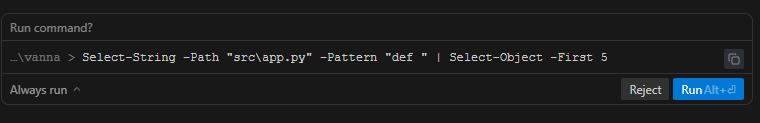
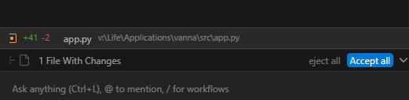
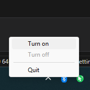

# Dumb Waiter

Tired of being prompted even though you have allowed your AI agent to run certain commands? 
`dumb_waiter.py` watches UI controls in windows matching a title regex (for example `Antigravity`) and clicks target buttons in priority order (typically `Accept all`, then `Run`).

## What It Clicks

### Run prompt example


### Accept all prompt example


## Tray App

Turn off the Dumb Waiter while you are interactively coding, and turn it on if you want things to run autonomously over night.



> [!WARNING]
> - Dumb Waiter can approve and execute actions without human review.
> - Use this only if you **understand exactly** what may run and have explicit sandbox/permission limits in place.
> - **Check in (commit/push) your code** before leaving anything unattended.
> - If you are not confident about security or blast radius, **do not run this unattended**.
> - This project is provided as-is, without warranty; you are responsible for any impact on code, systems, or data.

## What this project includes

- `dumb_waiter.py`: core watcher/clicker process.
- `run_resilient_dumb_waiter.ps1`: watchdog wrapper that restarts `dumb_waiter.py` if it exits.
- `dumb_waiter_tray/`: tray controller (`Turn on` / `Turn off`) plus startup-task and EXE build scripts.

## Quick setup

Install Python deps for the core script:

```powershell
python -m pip install pyyaml pyautogui pywinauto
```

If you want tray mode:

```powershell
python -m pip install -r .\dumb_waiter_tray\requirements.txt
```

## `config.yaml` settings to customize

Most users only need to edit a few fields:

- `uia.window_title_regex`: required. Limits clicks to matching window titles.
  - Example: `"Antigravity"`
  - Example: `"VS Code|Visual Studio Code"`
- `interval_seconds`: polling frequency.
  - Lower value = faster reaction, more CPU wake-ups.
  - Higher value = fewer checks, slower reaction.
- `targets`: click priority order.
  - Default is `accept all` first, then `run`.
- `uia.target_regexes`: optional regex per target (same order as `targets`).
  - Useful for labels like `RunAlt+⏎`.
- `scope.enabled` + `scope.preset`: optional area filter to avoid false positives.
  - Common preset values: `right_half`, `bottom_right_quarter`, `full_screen`.
- `scope.inset_percent`: shrinks scope inward to avoid edge clicks.
- `debug_mode`: set `true` to print candidate UI labels and regex checks.
- `verbose`: set `true` for periodic idle/diagnostic logs.
- `ignore_keyboard_interrupt` / `continue_on_error`: keep watcher alive in noisy environments.

Common example (watch VS Code windows with faster polling):

```yaml
interval_seconds: 1.0
uia:
  window_title_regex: "VS Code|Visual Studio Code"
```

## Run options

### 1) Direct terminal run (`dumb_waiter.py`)

```powershell
python .\dumb_waiter.py --config .\config.yaml
```

Use this when:
- You are actively testing config/regex/scope.
- You want simple, direct behavior.

Tradeoff:
- If another tool force-kills all `python` processes, this instance dies too.

### 2) Resilient terminal run (`run_resilient_dumb_waiter.ps1`)

```powershell
powershell -ExecutionPolicy Bypass -File .\run_resilient_dumb_waiter.ps1
```

Use this when:
- Another process may kill `python.exe` (for example hot-reload scripts).
- You want the watcher to auto-restart if terminated.

Optional explicit paths:

```powershell
powershell -ExecutionPolicy Bypass -File .\run_resilient_dumb_waiter.ps1 `
  -PythonPath "N:\VENVS\vanna_poc\Scripts\python.exe" `
  -ScriptPath "V:\Life\Applications\dumb_waiter\dumb_waiter.py" `
  -ConfigPath "V:\Life\Applications\dumb_waiter\config.yaml" `
  -RestartDelaySeconds 1
```

### 3) Tray mode (`dumb_waiter_tray`)

Run from Python:

```powershell
python .\dumb_waiter_tray\tray_app.py --config .\config.yaml
```

Or no console window:

```powershell
pythonw .\dumb_waiter_tray\tray_app.py --config .\config.yaml
```

Run tray with diagnostics (recommended when tray behavior differs from direct script):

```powershell
python .\dumb_waiter_tray\tray_app.py --config .\config.yaml --debug --worker-debug --worker-verbose
```

Debug logs:
- `dumb_waiter_tray/tray.log` (tray lifecycle, launch command, worker exits)
- `dumb_waiter_tray/worker.log` (`dumb_waiter.py` output, including UIA debug candidates)
- `dumb_waiter_tray/dist/startup_error.log` (fatal tray EXE startup exceptions)

Tray worker launch now forces UTF-8 I/O (`PYTHONUTF8=1`, `PYTHONIOENCODING=utf-8`)
to avoid Unicode logging failures on labels like `RunAlt+⏎`.
If you run a previously built tray EXE, rebuild it after pulling tray code changes.

Use this when:
- You want quick `Turn on` / `Turn off` control from system tray.
- You want visual state (green idle, red active).
- You want optional startup at logon.

Install startup task (optional):

```powershell
powershell -ExecutionPolicy Bypass -File .\dumb_waiter_tray\scripts\install_startup_task.ps1
```

Install and start immediately (optional):

```powershell
powershell -ExecutionPolicy Bypass -File .\dumb_waiter_tray\scripts\install_startup_task.ps1 -StartNow
```

Install startup task with debug flags enabled:

```powershell
powershell -ExecutionPolicy Bypass -File .\dumb_waiter_tray\scripts\install_startup_task.ps1 -StartNow -Debug -WorkerDebug -WorkerVerbose
```

⚠️ Warning: if task registration fails with `Access is denied`, run PowerShell as Administrator and retry.

After starting, look for the Dumb Waiter tray icon near the clock:
- Green icon = tray app idle (watcher off)
- Red icon = watcher active (clicker on)
- If not visible, open tray overflow (`^`) and pin it

You may need to run:
```powershell
Start-ScheduledTask -TaskName DumbWaiterTray
```

## EXE build (recommended for resilience against `Stop-Process -Name python`)

Build tray EXE:

```powershell
powershell -ExecutionPolicy Bypass -File .\dumb_waiter_tray\build_tray_exe.ps1
```

Run preflight checks only (no build/install):

```powershell
powershell -ExecutionPolicy Bypass -File .\dumb_waiter_tray\build_tray_exe.ps1 -PreflightOnly
```

The build script now runs preflight automatically before build/install.

Why this helps:
- A kill command targeting `python.exe` does not match `dumb_waiter_tray.exe`.

Build + install startup task in one command (optional):

```powershell
powershell -ExecutionPolicy Bypass -File .\dumb_waiter_tray\build_tray_exe.ps1 -InstallStartupTask
```

With current script behavior, `-InstallStartupTask` also starts the task immediately.
Disable immediate start if needed:

```powershell
powershell -ExecutionPolicy Bypass -File .\dumb_waiter_tray\build_tray_exe.ps1 -InstallStartupTask -StartAfterInstall:$false
```

Build + install + start with task debug flags:

```powershell
powershell -ExecutionPolicy Bypass -File .\dumb_waiter_tray\build_tray_exe.ps1 -InstallStartupTask -TaskDebug -TaskWorkerDebug -TaskWorkerVerbose
```

⚠️ Warning: the `-InstallStartupTask` step may require an elevated (Administrator) PowerShell session on some machines.

## Operational notes

- UI automation requires an interactive desktop session; locked-screen automation is not reliable.
- `config.yaml` controls targets, title regex, polling interval, and optional scope presets.
- Default behavior is target priority order from `targets` (first to last).
